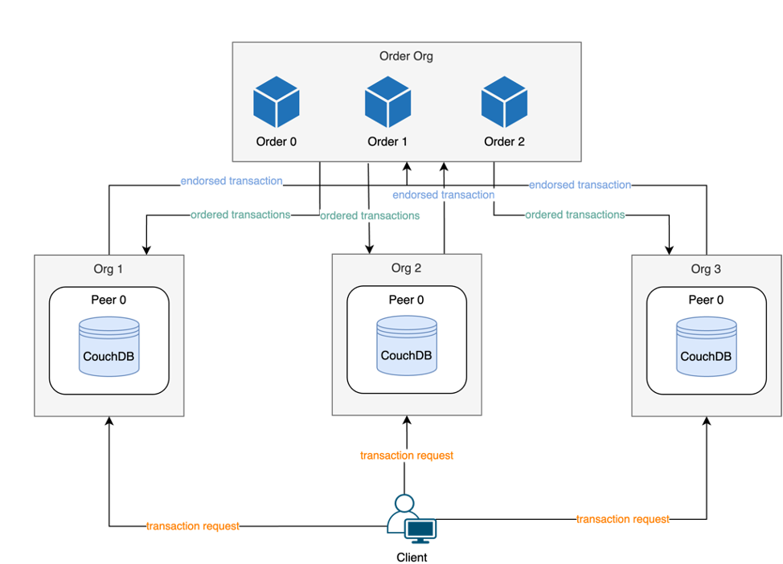
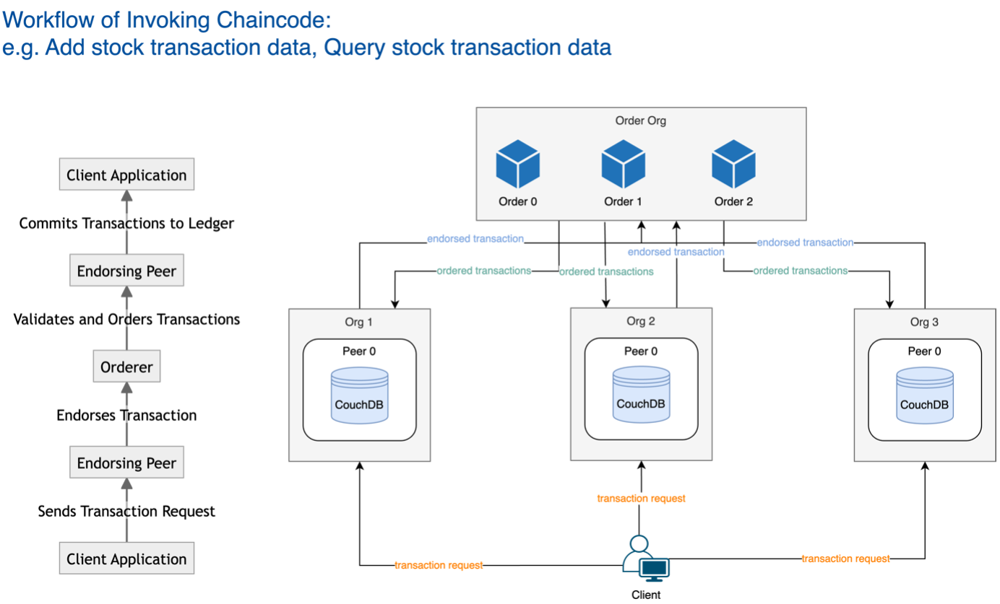
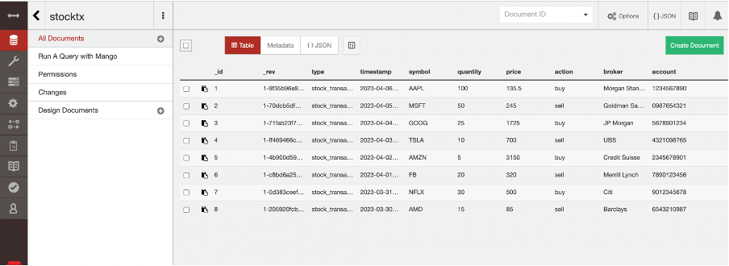
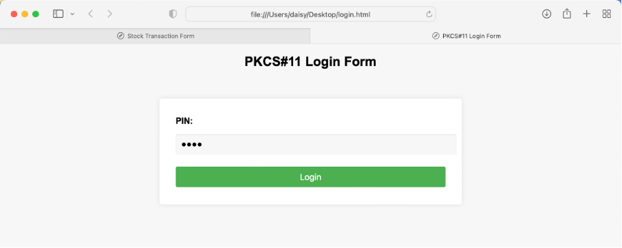
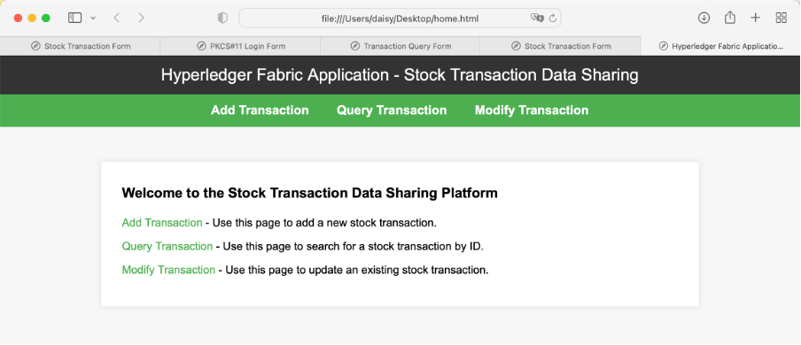
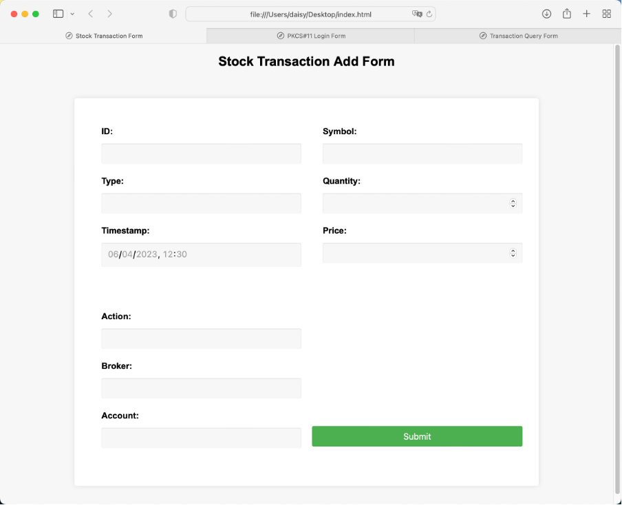
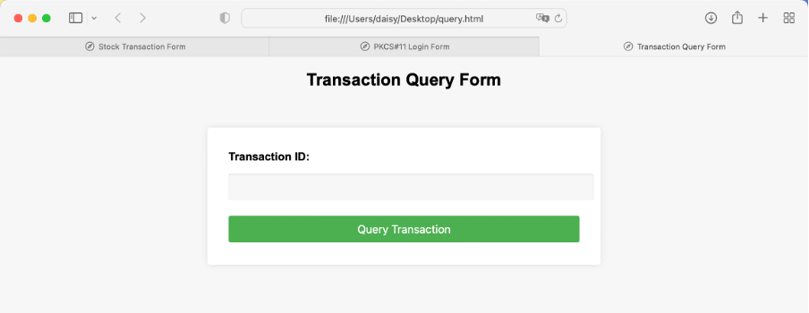
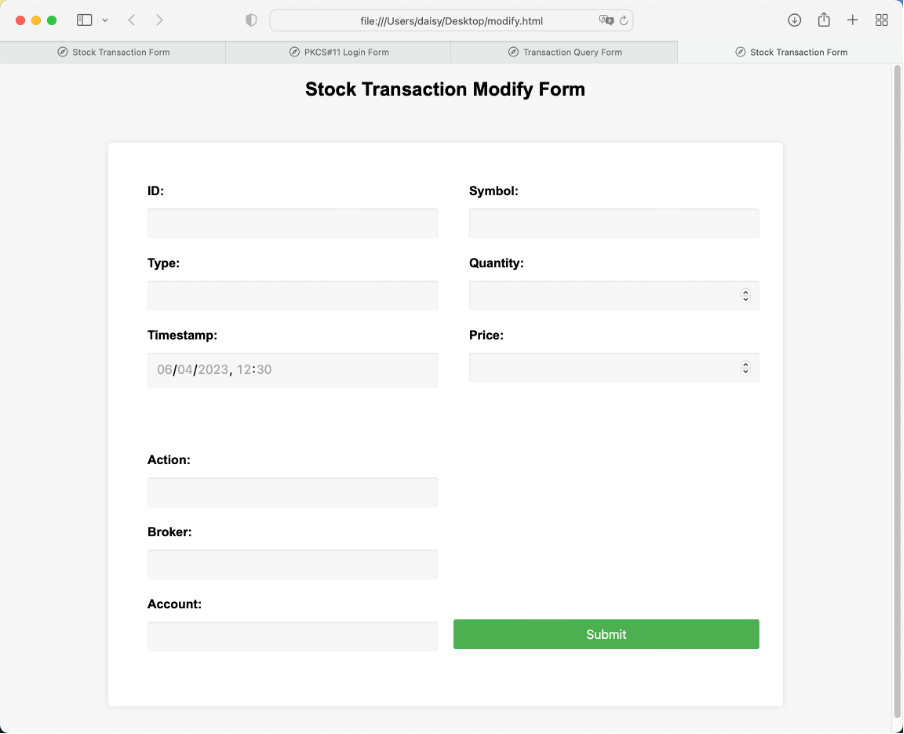

# SECURED REAL-TIME DATA SHARING/EXCHANGE NETWORK (PLATFORM)
- Backend: https://github.com/WANG-Tingyu/ShareNetwork-Fabric.git
- Frontend: https://github.com/WANG-Tingyu/txfabric-app.git
- Demo: https://youtu.be/K3EcpkUQH8I
:star2: **Found this repository helpful?** Light it up with a star and make my day! :wink:
---
This is a platform based on Hyperledger Fabric connecting multiple parties (in a distributed network). Each party owns data assets in 3 categories: i) public, ii) shared and iii) private. There is a need to exchange shared data assets between certain parties via secured channels on the platform. These information is highly sensitive and shall not sit in a centralized 3rd party server. Any modification of the shared information shall be shared within the same channel and audit trailed. Data security is the key and unauthorized alternation to the shared data asset shall be prohibited and any intend action should be traceable.


- Accommodate Users
  - Human employees
  - Bots

- Data Categories

   - Public
   - Shared
   - Private

- Security Measures
   - Endorsement for data sharing and modifications 
   - Chaincode for auditability and traceability

- User Experience
  - Intuitive user interface 
  - Robust API for seamless interaction


## 0. Setup
### Backend - Setup Process
- Step 1. Run CA services for all organizations
- Step 2. Generate cryptographic materials (public and private keys for peers, root certificate for CA)
- Step 3. Create channel artifacts using each organization's MSP (channel configuration, anchor peers)
- Step 4. Create channel and add each organization's peers • Set up peers with correct MSP and anchor peer
- Step 5. Deploy chaincode
  - Package chaincode
  - Install chaincode on peers
  - Approve chaincode definition on channel
  - Commit chaincode definition to channel

### Backend - Invoking Process

- Step 1. Client application initiates a transaction request
- Step 2. Request sent to the endorsing peer
  - Endorsing peer validates and endorses the transaction 
  - Chaincode executed to verify transaction rules
- Step 3. Endorsed transaction sent to the orderer
  - Orderer validates and orders the transactions
- Step 4. Ordered transactions broadcasted to peers for committing to the ledger

### Steps:
1) Clone the repo
2) Run Certificates Authority Services for all Orgs
3) Create Cryptomaterials for all organizations
4) Create Channel Artifacts using Org MSP
5) Create Channel and join peers
6) Deploy Chaincode
   1) Install All dependency
   2) Package Chaincode
   3) Install Chaincode on all Endorsing Peer
   4) Approve Chaincode as per Lifecycle Endorsment Policy
   5) Commit Chaincode Defination
7) Create Connection Profiles
8) Start API Server
9) Register User using API
10) Invoke Chaincode Transaction
11) Query Chaincode Transaction

- Step 1
```shell
git clone https://github.com/WANG-Tingyu/ShareNetwork-Fabric.git
```

- Step 2-6
```shell
cd FabricNetwork-2.x/

cd artifacts/channel/create-certificate-with-ca
docker-compose up -d
docker ps
./create-certificate-with-ca.sh


cd ..
./create-artifacts.sh

cd ..
docker-compose up -d
docker ps

cd ..
./createChannel.sh

./deployTransactionCC.sh
# Backend - Setup Process Done
```

- Start Postman and UI
- Then,

```shell
# Deploy another chaincode fabcar
# You can deploy more than one chaincode on this network
# Besides, you can customize your own chaincode based on your business need
cd artifacts/src/github.com/fabcar/go/
go mod tidy
cd ../../../../..
./depolyChaincode.sh
```

- Step 7-9
```shell
cd api-2.0/
npm install

cd config/
./generate-ccp.sh

cd ..
nodemon app.js

# If port 4000 is occupied, type
# sudo lsof -i :4000
# sudo kill <PID>

# After it is successfully started, connect to a local port on a remote SSH server
ssh -L 4000:127.0.0.1:4000

# Back to Postman
# First, register user, get returned token
# Then, paste token to ADD, add a new Transaction 
```

```shell
# Check newly added user in CouchDB, connect to a local port on a remote SSH server
ssh -L 5984:127.0.0.1:5984
# CouchDB Dashboard link: http://localhost:5984/_utils/#login
# Username: admin
# Password: adminpw
```
- Back to Postman, add Transaction, keep same tx_id, modify others attributes
- Go to CouchDB, find that record. Check its rev (version number), which represents version change to 2.
- Back to Postman, find getTxByID. Paste user token. Then call it.

```shell
# Deploy new Chaincode:
# Back to server, open new terminal in FabricNetwork-2.x
./deployDocumentCC.sh
```

## 1. Introduction
### 1.1 Background 

- Data assets have become increasingly crucial for decision-making, analytics, and driving value across various industries. In this context, multi-party data sharing plays a pivotal role in realizing the full potential of these assets. However, challenges arise due to the adoption of diverse data management systems among cooperative enterprises, resulting in reduced data utilization. Furthermore, the reproducibility and easy dissemination of data assets complicate auditing and traceability.
- Traditional solutions often depend on trusted centralized cloud service providers, raising concerns about data privacy and information security. Decentralized storage approaches, such as blockchain technology, have emerged as promising alternatives to address these issues. Blockchain is a distributed system for recording information, most commonly used to document transaction data. By leveraging cryptography and consensus protocols, blockchain ensures data immutability, transparency, and traceability.
- Permissioned blockchains, such as Hyperledger Fabric, offer a suitable solution for storing private data, which is particularly relevant for financial institutions, enterprises, and hospitals. Hyperledger Fabric enables developers to create distributed applications using programming languages, without the need for native cryptocurrencies, and provides extensive customization options. This versatility has led to the adoption of Hyperledger Fabric in a wide range of business use cases.

### 1.2 Objective

- The primary objective of this project is to design and implement a real-time data sharing platform utilizing Hyperledger Fabric blockchain technology for secure and efficient data sharing within a company, specifically focusing on stock transaction data. The platform will cater to both human employees and bots, with manual data uploads by employees and automatic uploads facilitated by bots.
- The data sharing platform will be tailored to support three categories of data: i) public, ii) shared, and iii) private, allowing for various levels of access and control. By ensuring that only authorized parties can access the shared data within specific channels, the HK Post E- Cert with token will be used to simulate smart card employee login, and sensitive data will be securely stored using AES encryption. CouchDB, chosen for its superior flexibility compared to LevelDB, will serve as the database solution.
- A key component of the project is the development of an intuitive user interface and robust application programming interface (API) to enable seamless interaction with the platform. The user interface will be designed to provide a user-friendly experience for human employees, while the API will facilitate efficient data exchange with bots.
- To further enhance the platform's security, all sharing and modification of sensitive data within the permissioned collaborator network will require endorsement. All changes to shared data must be authorized and subsequently synchronized across the same channel. By leveraging Chaincode within the blockchain framework, the platform will ensure auditability and traceability for all operations, addressing critical concerns related to data privacy and security.
- Ultimately, this project aims to develop a comprehensive data sharing solution that combines the advantages of Hyperledger Fabric blockchain technology with a versatile and secure infrastructure. The platform's support for both human employees and bots, coupled with its user interface and API, will enable efficient data sharing and collaboration among multiple parties within the company, specifically for stock transaction data.

## 2. System Design
### 2.1 Frontend Workflow

1. User inserts the physical token into their device and navigates to the login page of the web application.
2. The web application prompts the user to enter their PIN to authenticate the token.
3. The web application sends a request to the PKCS#11 API to retrieve the public key
   and certificate from the token.
4. The web application generates a session token for the authenticated user and stores it in local storage.
5. The user is redirected to the home page of the web application, which includes a navigation bar with links to the different functions (add transaction, modify transaction, query transaction).
6. When the user clicks on a link, the web application sends an HTTP request to the backend API to perform the corresponding function.
7. The backend API validates the session token included in the request header and verifies that the user has permission to perform the requested function.
8. If the session token is valid and the user is authorized, the backend API performs the requested function (e.g. adds a transaction to the blockchain, modifies an existing transaction, queries a transaction by ID).
9. If the function is successful, the backend API sends a response to the web application with the relevant data (e.g. the ID of the added/modified transaction, the details of the queried transaction).
10. The web application displays the relevant data to the user in a user-friendly format.
11. If the function cannot be performed, the backend API sends a response to the web
    application indicating the reason for failure.
12. The web application displays an error message to the user.

### 2.2 Backend Workflow
#### 2.2.1 Components
The proposed platform for data sharing in stock transaction data using Hyperledger Fabric is designed with the following components:
- Certificate Authority (CA): Each organization has its own separate CA, responsible for issuing and revoking certificates for the organization's peers.
- Peer: Each organization has one endorsing peer responsible for endorsing transactions, validating the chaincode, and committing the transaction to the ledger. Each peer has its own current state database using CouchDB, providing an efficient way to query the latest data.
- Orderer: The platform has three orderers (three organization) responsible for validating transactions, ordering them in a valid sequence, and broadcasting the results to the peers.
- Channel: The platform has one channel (could be more than one, just for demostration), which provided a secure and private way for the peers to communicate and transact with each other.
- Chaincode: The platform uses a chaincode that allowed for adding stock transaction data to the database.
#### 2.2.2 Setup Stage
The setup stage for the platform involved the following steps:
1. Run Certificate Authority Services for all Orgs: Each organization's CA was set up to
provide cryptographic certificates to the organization's peers.
2. Generate Cryptomaterials for all organizations: Cryptographic materials, including
public and private keys for the peers and the root certificate for the CA, were
generated for each organization.
3. Create Channel Artifacts using Org MSP: Channel artifacts were created using the
MSP of each organization, including the channel configuration and the anchor peers
for each organization.
4. Create Channel and join peers: The channel was created, and the peers of each
organization were added to the channel. The peers were configured to use the correct MSP and anchor peer.
5. Deploy Chaincode: The chaincode was packaged, installed on the endorsing peers, approved according to the lifecycle endorsement policy, and committed to the channel.

#### 2.2.3 Invoke Chaincode Stage
The invoke Chaincode stage (including adding new stock transaction record and query stock transaction record) involved the following steps:
1. Client application initiates transaction: A client application initiated a transaction by sending a request to the endorsing peer.
2. Endorsing Peer Endorses Transaction: The endorsing peer received the transaction request, validated it, and endorsed the transaction by executing the chaincode.
3. Orderer Validates and Orders Transactions: The endorsed transaction was sent to the orderer, which validated and ordered the transactions in a valid sequence.
4. Commit Transactions to Ledger: The ordered transactions were sent to the endorsing peer, which committed them to the ledger, making them available for query.
   

#### 2.2.4 Database
- CouchDB is a popular NoSQL database designed to handle large-scale and distributed applications, making it an ideal choice for the Hyperledger Fabric-based stock transaction data sharing platform. CouchDB is an open-source, document-oriented database that uses JSON to store data, JavaScript as its query language, and HTTP for its API. Its primary features include high performance, ease of use, and a robust replication and synchronization mechanism.
- The data sharing platform's backend system comprises several components, including Certificate Authority, Peer, Orderer, Channel, and Chaincode. CouchDB is employed as the current state database for each peer, allowing for efficient querying of the latest data. In this platform, stock transaction data is stored as JSON documents, as shown in the example below:
```json
{
  "_id": "1",
  "_rev": "1-9f35b96e928425bc2c6a78dba8241e30",
  "type": "stock_transaction",
  "timestamp": "2023-04-06T11:30:00Z",
  "symbol": "AAPL",
  "quantity": 100,
  "price": 135.5,
  "action": "buy",
  "broker": "Morgan Stanley",
  "account": "1234567890"
}

```
- The UI of CouchDB:
  
  The above JSON document represents a stock transaction record, with fields such as transaction type, timestamp, stock symbol, quantity, price, action (buy/sell), broker, and account number. CouchDB's document-oriented approach enables efficient storage and retrieval of such transaction data, as well as seamless integration with the Hyperledger Fabric platform. Additionally, CouchDB's built-in support for replication and synchronization ensures data consistency and reliability across the distributed network, contributing to the platform's overall robustness and performance.

## 3. Methodology
- The methodology for developing this Hyperledger Fabric-based data sharing platform consisted of several stages, including:
  1.	Requirement gathering: The first stage of the project involved gathering requirements from stakeholders within the company. This included understanding the use cases for data sharing, identifying the key features required in the platform, and determining the security and compliance requirements.
  2.	System design: Based on the requirements gathered, the system design for the platform was created. This included the architecture of the blockchain network, the data model for stock transactions, and the user interface and API design.
  3.	Development: The platform was developed using the Hyperledger Fabric SDK, along with other relevant technologies such as Node.js, Express, and React. The backend system was developed to support key functions such as adding, modifying, and querying stock transactions, as well as user authentication and authorization.
  4.	Testing: The platform was extensively tested to ensure that it met the requirements and performed as expected. This included unit testing and integration testing.
  5.	Deployment: Once testing was complete, the platform was deployed to the production environment. This included configuring the blockchain network, deploying the backend system, and setting up the user interface and API.
- Overall, the methodology for developing the data sharing platform was designed to ensure that the platform met the requirements for efficient data sharing and collaboration, while also ensuring security, compliance, and usability.


## 4. Results
- The proposed data sharing platform was successfully developed and deployed, meeting the requirements of efficient data sharing and collaboration among multiple parties within the company. The platform utilized the advantages of Hyperledger Fabric blockchain technology to enable a wide range of use cases related to stock transaction data, e.g. query and add.
- The platform's support for both human employees and bots, coupled with its user interface and API, enabled human users to easily add, modify, and query stock transactions via UI, and rob user to do it via API. It also included features such as user authentication and authorization, data privacy and encryption.
- Overall, the results of the project demonstrated the feasibility and benefits of utilizing blockchain technology for data sharing within a company. The platform provided a secure, transparent, and efficient way to share and collaborate on stock transaction data.

### 4.1 User Interface Example
- User login via token:

- After login, redirect to home page:

- Add stock transaction form. Send http request:

- Query transaction by transaction ID. Send http request:

- Modify transaction by transaction ID. Send http request:


## 6. Discussion
### 6.1 Strengths
- 	Utilizes the advantages of blockchain technology, such as immutability, transparency, and security, to provide a more effective and reliable way to share and collaborate on data.
-	Supports both human employees and bots, enabling a wide range of use cases related to data sharing.
-	User-friendly user interface and API.
-	Includes features such as user authentication and authorization, data privacy and encryption, and compliance with relevant regulations and standards.
-	Developed and deployed in a reliable and secure manner, with a focus on meeting the requirements of stakeholders within the company.

### 6.2 Weaknesses
-	Requires users to have access to the platform and knowledge of how to use it, which may require additional training and resources.
-	Requires additional infrastructure and maintenance, which may be costly.

### 6.3 Future Development and Improvements
-	Consider expanding the platform to support other types of data sharing within the company
-	Consider integrating the platform with other systems and technologies within the company to streamline processes and increase efficiency.

## 7. Conclusion
In conclusion, the proposed data sharing platform successfully utilized Hyperledger Fabric blockchain technology and a versatile and secure infrastructure to enable efficient data sharing and collaboration among multiple parties within the company. The platform's support for both human employees and bots, coupled with its user interface and API, provided a valuable tool for enabling efficient and secure data sharing and collaboration. While there are limitations to the platform, including its focus on the use case of stock transaction data, it demonstrated the potential benefits of utilizing blockchain technology in the enterprise context.
## References
- Azaria, A., Ekblaw, A., Vieira, T., & Lippman, A. (2016, August). Medrec: Using blockchain for medical data access and permission management. In 2016 2nd international conference on open and big data (OBD) (pp. 25-30). IEEE.
- Raikwar, M., Mazumdar, S., Ruj, S., Gupta, S. S., Chattopadhyay, A., & Lam, K. Y. (2018, February). A blockchain framework for insurance processes. In 2018 9th IFIP International Conference on New Technologies, Mobility and Security (NTMS) (pp. 1-4). IEEE.

---
:star2: **Found this repository helpful?** Light it up with a star and make my day! :wink:


 
